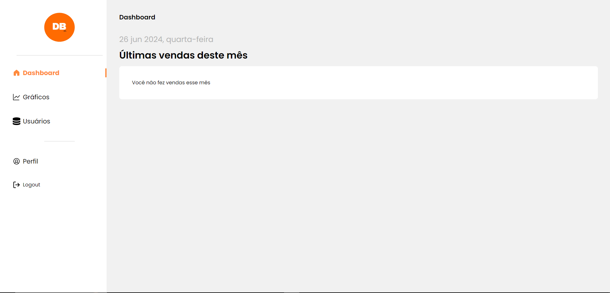

# DataBase
<h1 align="center">DB - Data Base</h1>

 Site criado para a integração de um banco de dados a partir de um desafio para uma seleção. 

  <a href="#-tecnologias">Tecnologias</a>&nbsp;&nbsp;&nbsp;|&nbsp;&nbsp;&nbsp;
  <a href="#-projeto">Projeto</a>&nbsp;&nbsp;&nbsp;|&nbsp;&nbsp;&nbsp;
  <a href="#memo-licença">Licença</a>

  

 

 
    

## 🚀 Tecnologias

-Nesse projeto foi utilizado as seguintes tecnologias:

- REACT 
- Tailwind  
- JavaScript / TypeScript  
- Docker  
- HTML  
- Github  

## 💻 Projeto

Site criado para a integração de um banco de dados a partir de um desafio para uma seleção, assim como também foi usado para apredizado de novas funcionalidades com finalidade educativa que tem as seguintes telas:  
    - Dashboard com as vendas do mês;  
    - Gráficos das vendas referente aos vendedores e mês;  
    - Usuários com permissão de acesso;  
    - Perfil com as especificações do usuário.  

- Por questão de manter a privacidade dos dados da empresa não será possivel disponibilizar visualização com a conexão ao banco de dados. 

Esse projeto está sob a licença MIT.

---

Feito com ♥ by Helena Lima

